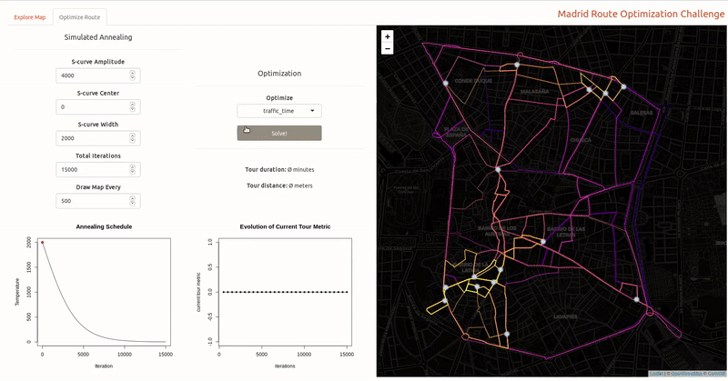

# Madrid Open Data Challenge

This repo contains the code for an open data challenge promoted by [Kopuru](http://kopuru.com/). 

The [challenge](http://kopuru.com/desafio/reto-open-data-optimizacion-de-la-recogida-de-vidrio-en-madrid-central/) here is to calculate and show on a map which is the shortest route for the collection of glass containers within the district of Madrid Central. In doing so, we could help the City Council of Madrid through the use of data to improve the service to its citizens. 
The final result is hosted on [shinyapps.io](https://www.shinyapps.io/) and it is available [here](https://imartinezl.shinyapps.io/madrid-challenge/).

## Challenge Objectives

- To create a visualization platform that delimits the area of Central Madrid and collects the geolocation of the different types of containers.

- To calculate and visualize the route to be followed identifying the starting point, route, end point and distance travelled. The team that identifies the shortest route (measured in meters) respecting the direction of the streets will win.

## General Idea

So, this is actually not a big deal. First we will create a model of the system resembling the very well known TSP (Traveling Salesman Problem). Then, we will choose one of the available optimization methods to solve the TSP problem. More details below.

## Data Adquisition

[datos.madrid.es](https://datos.madrid.es/portal/site/egob/) is a service provided by the city council of Madrid with the purpose of providing a large amount of data and information that can be reused by the general public. In this dataset you can find the addresses and geolocalized points of each of the containers of paper-cardboard, glass, containers, organic and remains available in the districts of the city. 

  
  
  
  
  
  

- [Clothes Containers](https://datos.madrid.es/egob/new/detalle/auxiliar/mapa.jsp?geoUrl=https://datos.madrid.es/egob/catalogo/204410-0-contenedores-ropa.geo): In this dataset you can find the addresses, collection schedules and geolocalized points of each of the used clothing containers that are located at various points in the city, in municipal outbuildings and markets, recycling points, mobile recycling points and proximity recycling points.

- [Battery Containers](https://datos.madrid.es/egob/new/detalle/auxiliar/mapa.jsp?geoUrl=https://datos.madrid.es/egob/catalogo/209799-0-contenedores_pilas_marquesinas.geo): Alkaline/saline batteries and "button" batteries to be disposed of should be taken to a mobile recycling point, as their presence along with the rest of the waste can be dangerous. the city of Madrid also has a network of devices specially prepared for depositing batteries in the bus stop marquees. This set of data provides this information.

- [Oil Containers](https://datos.madrid.es/egob/new/detalle/auxiliar/mapa.jsp?geoUrl=https://datos.madrid.es/egob/catalogo/300196-0-contenedor-aceitevegetal-usado.geo): In this dataset you can find the addresses, collection times and geolocalized points for each of the used vegetable oil containers that are available in the districts. In total there are more than 380 different locations in the city.

- [Recycling Points](https://datos.madrid.es/egob/new/detalle/auxiliar/mapa.jsp?geoUrl=https://datos.madrid.es/egob/catalogo/200284-0-puntos-limpios.geo): Information on data, location, characteristics, timetables, location coordinates and services of the different municipal recycling points in the city of Madrid.

- [Mobile Recycling Points](https://datos.madrid.es/egob/new/detalle/auxiliar/mapa.jsp?geoUrl=https://datos.madrid.es/egob/catalogo/300101-0-puntos-limpios.geo): Information on data, location, characteristics, timetables and days available, location coordinates and services of the different mobile municipal clean points in the city of Madrid.
The mobile recycling points are small, easily identifiable trucks that go to specific places in the districts for a few hours on certain days to receive the waste that cannot be deposited in normal street containers.

- [Proximity Recycling Points](https://datos.madrid.es/egob/new/detalle/auxiliar/mapa.jsp?geoUrl=https://datos.madrid.es/egob/catalogo/300198-0-puntos-proximidad.geo): At the proximity recycling points, ten in total, may be deposited twelve different types of domestic waste, used vegetable oil, used clothing and footwear, waste from small electrical and electronic devices, used batteries, fluorescent and energy-saving light bulbs, toner cartridges and aerosols, X-rays, and CDs, DVDs and videotapes. They will be located in limited municipal enclosures, distributed throughout the city's neighbourhoods. Their use is subject to the opening hours of the centres where they are installed, with the exception of the Barceló Market, which is installed in the public thoroughfare.

## Data Preprocessing

First of all, the datasets in *csv* format were downloaded and imported into R. In order to show the information in the proper format, some feature modifications were necessary.

Geographical information in *shp* format, such as the "Madrid Central" delimitation and Madrid districts and neighborhoods were imported with the *readOGR* function from [rgdal](https://cran.r-project.org/web/packages/rgdal/index.html) package. 

In order to detect the glass containers inside the Madrid Central zone, I used the function *point.in.polygon* from the [sp](https://cran.r-project.org/web/packages/sp/index.html) package. Really helpful, by the way. Otherwise I would have stuck a lot of time on this step. 

## Data Visualization

Data visualization was carried out with [leaflet](https://rstudio.github.io/leaflet/) for R. In order to improve the aesthetics, I assigned a icon to each dataset. You can play with the map [here](https://imartinezl.shinyapps.io/madrid-challenge/), on the "Explore Map" tab.

  

## Route Optimization

The route optimization was inspired by Todd W. Schneider [approach](https://github.com/toddwschneider/shiny-salesman), where he designs a Shiny app to solve the traveling salesman problem with simulated annealing. THe distances and travel times were queried from [HERE](https://developer.here.com/) maps API. The number of queries were reduced as much as possible, reducing the number of   neighbours to a fixed value N, given that the *completeness* of the graph remained untouched. 

### Simulated Annealing

The process of simulated annealing work as follows: It starts by picking an arbitrary initial tour from the set of all valid tours. From that initial tour it “moves around” and checks random neighboring tours to see how good they are. There are so many valid tours that it won’t be able to test every possible solution. But a well-designed annealing process eventually reaches a solution that, if it is not the global optimum, is at least good enough. Here’s a step-by-step guide:

1. Start with a random tour through the selected points. 
2. Pick a new candidate tour at random from all neighbors of the existing tour This candidate tour might be better or worse compared to the existing tour, i.e. shorter or longer.
3. If the candidate tour is better than the existing tour, accept it as the new tour.
4. If the candidate tour is worse than the existing tour, still maybe accept it, according to some probability. The probability of accepting an inferior tour is a function of how much longer the candidate is compared to the current tour, and the temperature of the annealing process. A higher temperature makes you more likely to accept an inferior tour.
5. Go back to step 2 and repeat many times, lowering the temperature a bit at each iteration, until you get to a low temperature and arrive at your (hopefully global, possibly local) minimum. If you’re not sufficiently satisfied with the result, try the process again, perhaps with a different temperature cooling schedule.

  

The key to the simulated annealing method is in step 4: even if we’re considering a tour that is worse than the tour we already have, we still sometimes accept the worse tour temporarily, because it might be the stepping stone that gets us out of a local minimum and ultimately closer to the global minimum. The temperature is usually pretty high at the beginning of the annealing process, so that initially we’ll accept more tours, even the bad ones. Over time, though, we lower the temperature until we’re only accepting new tours that improve upon our solution.

Why do we need the annealing step at all? Why not do the same process with 0 temperature, i.e. accept the new tour if and only if it’s better than the existing tour? It turns out if we follow this naive “hill climbing” strategy, we’re far more likely to get stuck in a local minimum. Simulated annealing doesn’t guarantee that we’ll reach the global optimum every time, but it does produce significantly better solutions than the naive hill climbing method. 

## Built with
- [R](https://www.r-project.org/) - Programming Language / 3.6.0
- [RStudio](https://www.rstudio.com/) - IDE for R / 1.2.1335
- [dplyr](https://dplyr.tidyverse.org/) - A grammar of data manipulation / 0.8.1
- [plyr](https://cran.r-project.org/web/packages/plyr/index.html) - Tools for Splitting, Applying and Combining Data / 1.8.4
- [reshape2](https://cran.r-project.org/web/packages/reshape2/index.html) - Flexibly Reshape Data / 1.4.3
- [leaflet](https://rstudio.github.io/leaflet/) - Interactive Maps / 2.0.2
- [ggplot2](https://ggplot2.tidyverse.org/) - Create graphics with R / 3.1.1
- [shiny](https://shiny.rstudio.com/) - Interactive web apps with R / 1.3.2
- [shinythemes](https://rstudio.github.io/shinythemes/) - Themes for Shiny / 1.1.2
- [shinycssloaders](https://github.com/andrewsali/shinycssloaders) - CSS loader animations for Shiny outputs  / 0.2.0
- [igraph](https://igraph.org/r/) - Network Analysis and Visualization / 1.2.4.1
- [geosphere](https://cran.r-project.org/web/packages/geosphere/index.html) - Spherical Trigonometry / 1.5-7
- [stringr](https://stringr.tidyverse.org/index.html) - Library for string manipulations / 1.4.0
- [stringi](https://cran.r-project.org/web/packages/stringi/index.html) - Character String Processing Facilities / 1.4.3
- [zeallot](https://cran.r-project.org/web/packages/zeallot/index.html) - Multiple, Unpacking, and Destructuring Assignment / 0.1.0
- [rgdal](https://cran.r-project.org/web/packages/rgdal/index.html) - Bindings for the 'Geospatial' Data Abstraction Library / 1.4-3
- [sp](https://cran.r-project.org/web/packages/sp/index.html) - Classes and Methods for Spatial Data / 1.3-1
- [htmltools](https://cran.r-project.org/web/packages/htmltools/index.html) - Tools for HTML / 0.3.6
- [viridis](https://cran.r-project.org/web/packages/viridis/index.html) - Default Color Maps from 'matplotlib' / 0.5.1 

